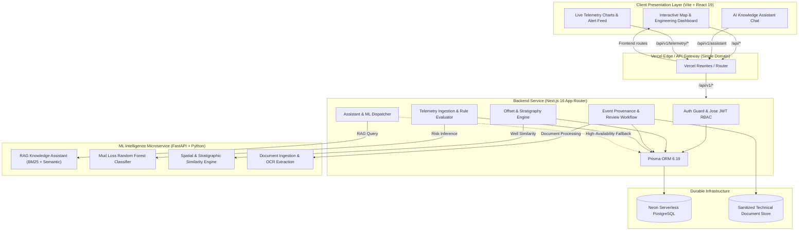
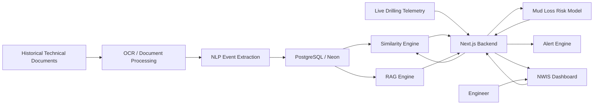
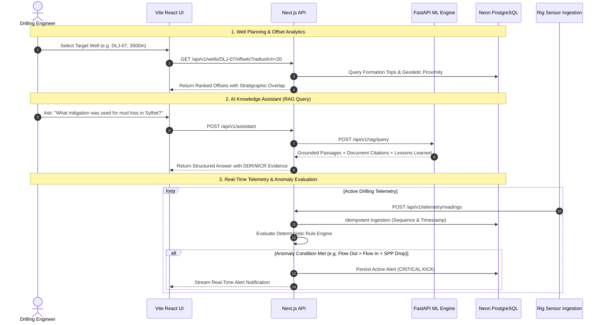

# 🌐 Nearby Wells Intelligence System (NWIS)

> **Smart India Hackathon 2026 — Problem Statement 121**  
> **Production-Grade Drilling Intelligence, Offset Well Similarity Analytics, Provenance RAG Assistant & Real-Time Telemetry Alerting Engine**

[](https://projectalteration-brown.vercel.app)
[](https://nextjs.org/)
[](https://react.dev/)
[](https://fastapi.tiangolo.com/)
[](https://neon.tech/)
[](https://www.prisma.io/)
[](https://python.org/)
[](https://www.typescriptlang.org/)

---

## 📑 Table of Contents

- [1. Executive Summary](#1-executive-summary)
- [2. System Architecture](#2-system-architecture)
- [3. End-to-End Operational Workflow](#3-end-to-end-operational-workflow)
- [4. Core Modules \& Features](#4-core-modules--features)
  - [A. Spatial Proximity \& Offset Analytics](#a-spatial-proximity--offset-analytics)
  - [B. Provenance-Tracked Technical Document Storage](#b-provenance-tracked-technical-document-storage)
  - [C. AI/ML Evidence-Backed RAG Assistant](#c-aiml-evidence-backed-rag-assistant)
  - [D. Machine Learning Risk Prediction](#d-machine-learning-risk-prediction)
  - [E. High-Throughput Telemetry \& Deterministic Alert Engine](#e-high-throughput-telemetry--deterministic-alert-engine)
- [5. Repository Structure](#5-repository-structure)
- [6. REST API Reference](#6-rest-api-reference)
- [7. Local Quickstart Guide](#7-local-quickstart-guide)
- [8. Vercel Multi-Service Deployment](#8-vercel-multi-service-deployment)
- [9. Data Provenance \& Security](#9-data-provenance--security)

---

## 1. Executive Summary

During well planning and active drilling operations, engineers must make rapid, high-consequence decisions. Unexpected subsurface hazards—such as **severe lost circulation (mud loss)**, **differential stuck pipe**, and **well kicks / influxes**—lead to catastrophic non-productive time (NPT) and significant financial loss.

**NWIS (Nearby Wells Intelligence System)** addresses this challenge through a multi-tier platform that integrates:
1. **Historical Offset Intelligence**: Automatic ranking and stratigraphy matching across offset wells in the Upper Assam basin.
2. **Deterministic Document Provenance**: Cryptographically verified extraction of events from Daily Drilling Reports (DDR), Well Completion Reports (WCR), and Mud Logs.
3. **Retrieval-Augmented Generation (RAG)**: Evidence-grounded AI knowledge assistant providing institutional lessons learned with direct page-level citations.
4. **Real-Time Telemetry & Alerting**: Out-of-order tolerant time-series ingestion and deterministic state-machine alert lifecycle management.

---

## 2. System Architecture

## 2. System Architecture

NWIS is engineered as a high-performance monorepo following Clean/Hexagonal architecture. The system separates the client presentation layer, API/backend services, ML intelligence services, and durable infrastructure.

### Architecture Overview



### 2.1 Architecture Layers

#### Client Presentation Layer

The frontend is responsible for visualization, user interaction, live telemetry, historical well exploration, and the AI knowledge assistant.

**Technology:**

* Vite
* React 19
* Tailwind CSS
* shadcn/ui
* React Query
* Recharts
* Map-based geospatial visualization

**Primary interfaces:**

* Interactive well map
* Active well dashboard
* Nearby/offset well visualization
* Historical event timeline
* Live telemetry charts
* Risk and alert feed
* AI Knowledge Assistant

---

#### Vercel Edge / API Gateway

NWIS uses a single-domain routing layer to expose the frontend and backend through a unified application endpoint.

The gateway is responsible for:

* Frontend route handling
* API route forwarding
* Backend service routing
* Authentication-aware request forwarding
* Separation of `/api/*` and frontend routes

```text
User
 │
 ▼
Single Domain
 │
 ├── Frontend Routes ──► Vite + React
 │
 └── /api/* ───────────► Next.js Backend
```

---

#### Backend Service

The backend is implemented using **Next.js 16 App Router** and acts as the main application and orchestration layer.

It does not contain the heavy ML logic. Instead, it coordinates requests between the frontend, database, document storage, and ML microservice.

##### Authentication & Authorization

```text
AUTH
 ├── JWT validation
 ├── Role-based access control
 ├── User authentication
 └── Protected API routes
```

**Technology:**

* Jose
* JWT
* RBAC

---

##### Offset & Stratigraphy Engine

Responsible for:

* Finding nearby wells
* Geospatial filtering
* Well-to-well distance calculations
* Depth correlation
* Formation/stratigraphic comparison
* Requesting similarity analysis from the ML service

```text
Active Well
     │
     ▼
Well Coordinates
     │
     ▼
Nearby Well Search
     │
     ▼
Stratigraphic Filtering
     │
     ▼
Similarity Engine
```

---

##### Event Provenance & Review Workflow

Responsible for managing historical drilling events and maintaining traceability back to the original documents.

Examples:

* Mud losses
* Kicks
* Stuck pipe
* Fishing
* Torque spikes
* Pressure spikes
* Formation changes
* Cementing problems
* Casing problems
* Non-productive time

Every extracted event should maintain provenance such as:

```text
Event
 ├── Well ID
 ├── Event Type
 ├── Depth
 ├── Formation
 ├── Severity
 ├── Description
 ├── Cause
 ├── Mitigation
 ├── Source Document
 ├── Source Page
 └── Extraction Confidence
```

The service also manages human review and verification of ML-generated historical events.

---

##### Telemetry Ingestion & Rule Evaluator

Responsible for:

* Receiving real-time drilling telemetry
* Normalizing incoming data
* Evaluating engineering rules
* Maintaining current well state
* Triggering ML inference
* Generating alerts

Example flow:

```text
eRTMAC / Telemetry
        │
        ▼
Telemetry Ingestion
        │
        ▼
Data Normalization
        │
        ├──────────────► Rule Engine
        │                    │
        │                    ▼
        │                 Alerts
        │
        ▼
Risk Model
        │
        ▼
Risk Probability
```

---

##### Assistant & ML Dispatcher

The RAG Gateway acts as the backend orchestration layer for AI-related requests.

It is responsible for:

* Receiving AI assistant requests
* Sending RAG queries to the ML service
* Requesting risk inference when required
* Combining ML results with database context
* Returning evidence-backed responses to the frontend
* Handling ML service failures and fallback behavior

---

### 2.2 ML Intelligence Microservice

The ML layer is implemented as an independent **FastAPI + Python microservice**.

The ML service contains the intelligence-heavy workloads and is intentionally separated from the Next.js backend.

```text
FastAPI ML Service
│
├── RAG Knowledge Assistant
│   ├── BM25 Retrieval
│   ├── Semantic Search
│   └── Context Retrieval
│
├── Risk Models
│   └── Mud Loss Classifier
│
├── Similarity Engine
│   ├── Spatial Similarity
│   ├── Depth Similarity
│   └── Stratigraphic Similarity
│
└── Document Intelligence
    ├── PDF Processing
    ├── OCR
    ├── Text Extraction
    └── Event Extraction
```

---

#### RAG Knowledge Assistant

The RAG engine provides evidence-backed access to historical drilling knowledge.

Pipeline:

```text
Historical Documents
        │
        ▼
Document Processing
        │
        ▼
Text Extraction / OCR
        │
        ▼
Chunking
        │
        ├──► BM25 Index
        │
        └──► Semantic Embeddings
                    │
                    ▼
              Vector Retrieval
                    │
                    ▼
             Relevant Context
                    │
                    ▼
                   LLM
                    │
                    ▼
            Evidence-backed Answer
```

The system should retain document and page-level provenance for retrieved information.

---

#### Mud Loss Risk Model

The first predictive model targets **mud loss risk**.

Potential input features include:

* Measured depth
* True vertical depth
* Formation
* Rate of penetration
* Weight on bit
* RPM
* Torque
* Standpipe pressure
* Flow rate
* Mud weight
* ECD
* Lithology
* Nearby historical events
* Offset-well similarity
* Historical mud-loss occurrences

Initial model:

```text
Random Forest Classifier
```

Future models can include:

* XGBoost
* Logistic Regression
* Gradient Boosting
* Calibrated probabilistic models

The model output should follow a stable API contract:

```json
{
  "well_id": "OIL-102",
  "depth_md": 2848,
  "risk_type": "MUD_LOSS",
  "probability": 0.78,
  "level": "HIGH",
  "model_version": "mud-loss-v1"
}
```

---

#### Spatial & Stratigraphic Similarity Engine

The similarity engine identifies historical wells that are relevant to the active well.

Similarity can incorporate:

* Geographic distance
* Formation overlap
* Depth interval
* Stratigraphic relationship
* Reservoir characteristics
* Well trajectory
* Historical drilling events
* Drilling parameter similarity

The initial implementation should remain interpretable so that drilling engineers can understand why a historical well was considered relevant.

---

#### Document Ingestion & OCR

The document intelligence pipeline converts historical technical documents into structured machine-readable information.

```text
PDF
 │
 ▼
Document Detection
 │
 ├── Searchable PDF
 │       │
 │       ▼
 │     Text Extraction
 │
 └── Scanned PDF
         │
         ▼
        OCR
         │
         ▼
Text Normalization
         │
         ▼
Section Detection
         │
         ▼
Table Extraction
         │
         ▼
Event Extraction
         │
         ▼
Structured Events
```

---

### 2.3 Durable Infrastructure

#### PostgreSQL / Neon

The primary transactional database is PostgreSQL hosted using Neon.

It stores:

* Wells
* Well trajectories
* Formations
* Drilling events
* Telemetry metadata
* Alerts
* Users
* Roles
* Review status
* Model outputs
* Document metadata
* Provenance information

Prisma is used as the application's database ORM.

```text
Next.js Backend
      │
      ▼
Prisma ORM
      │
      ▼
PostgreSQL
      │
      ▼
Neon
```

---

#### Technical Document Store

The document store contains sanitized technical documents and processed document artifacts.

Examples:

```text
documents/
├── WCR/
├── DDR/
├── MUD_LOG/
├── CEMENTING/
├── WELL_SURVEY/
└── PROCESSED/
```

Documents should never lose their original provenance.

Each extracted event should be traceable to:

```text
Document
   │
   └── Page
        │
        └── Section
             │
             └── Original Text
                  │
                  └── Extracted Event
```

---

### 2.4 End-to-End Data Flow

The complete NWIS intelligence flow is:



---

### 2.5 Design Principle

NWIS follows a **separation-of-concerns architecture**:

```text
React
  │
  ▼
API Gateway
  │
  ▼
Next.js Backend
  │
  ├── PostgreSQL
  ├── Document Store
  │
  └── FastAPI ML Service
          │
          ├── RAG
          ├── Risk Models
          ├── Similarity
          └── OCR / NLP
```

The core principle is:

> **The backend orchestrates. The ML service reasons. The database stores. The frontend visualizes.**

This separation allows the ML pipeline to evolve independently from the application layer while keeping the overall NWIS system modular, testable, and deployable.

## 3. End-to-End Operational Workflow



---

## 4. Core Modules & Features

### A. Spatial Proximity & Offset Analytics
- **Multi-Factor Well Ranking**: Combines geodetic distance (Haversine formula), formation stratigraphic overlap, depth interval matching, and historical incident count.
- **Stratigraphic Correlation**: Automatic depth interval mapping across Upper Assam formations (**Tipam Sandstone**, **Surma**, **Barail**, **Kopili Shale**, and **Sylhet Limestone**).

### B. Provenance-Tracked Technical Document Storage
- **Cryptographic File Sanitization**: SHA-256 checksum generation, MIME-type validation, and path traversal protection.
- **Audit Logging**: Every document upload and event extraction maintains an immutable record tied to authenticated user IDs.

### C. AI/ML Evidence-Backed RAG Assistant
- **Dual-Mode Indexing**: Indexes chunked daily drilling reports and completion reports with page-level provenance.
- **High-Availability Fallback**: If the ML engine is cold-starting, the backend automatically falls back to database-indexed historical events to guarantee zero downtime.

### D. Machine Learning Risk Prediction
- **Mud Loss Classifier**: Trained Random Forest model predicting lost circulation probability and risk levels (`LOW`, `MEDIUM`, `HIGH`, `CRITICAL`).
- **Feature Importance**: Returns top contributing operational parameters (ROP, WOB, RPM, Torque, Mud Weight, ECD, SPP) and mitigation suggestions.

### E. High-Throughput Telemetry & Deterministic Alert Engine
- **Idempotent Ingestion**: Machine-authenticated telemetry ingestion with database-enforced unique constraints `(wellId, sourceId, sequenceNumber)`.
- **Alert State Machine**: Immutable lifecycle transitions:
  $$\text{ACTIVE} \longrightarrow \text{ACKNOWLEDGED} \longrightarrow \text{RESOLVED}$$

---

## 5. Repository Structure

```text
ProjectAlteration/
├── backend/                       # Next.js 16 Backend Service
│   ├── prisma/
│   │   ├── migrations/            # Version-controlled SQL migrations
│   │   ├── schema.prisma          # Database schema (Wells, Telemetry, Alerts, Events)
│   │   └── seed.ts                # Database seed script from ML dataset
│   ├── src/
│   │   ├── app/api/v1/            # 38 Clean REST API route endpoints
│   │   ├── application/           # Hexagonal application services & DTOs
│   │   ├── domain/                # Pure domain entities, rules & repository ports
│   │   ├── infrastructure/        # Prisma adapters, Jose JWT, ML Client, Storage
│   │   └── lib/                   # Standardized API response and error formatting
│   └── package.json
│
├── frontend/                      # Vite + React 19 Frontend UI
│   ├── src/
│   │   ├── api/                   # HTTP client with auto-session demo authentication
│   │   ├── components/            # Well maps, telemetry charts, RAG chat, alert panels
│   │   └── index.css              # Custom Tailwind CSS design tokens
│   ├── index.html                 # Google Fonts IBM Plex Sans & Leaflet setup
│   ├── vite.config.js             # Vite dev server with /api proxy
│   └── package.json
│
├── ml/                            # Python ML Microservice
│   ├── data/                      # Raw and processed historical drilling documents
│   ├── models/trained/            # Pre-trained mud loss joblib models
│   ├── pipelines/                 # PDF ingestion, OCR, and event extraction scripts
│   ├── src/                       # RAG assistant, retriever, and risk prediction code
│   ├── tests/                     # 36 Unit & integration tests (Pytest)
│   ├── serve.py                   # FastAPI REST server
│   └── requirements.txt
│
├── vercel.json                    # Vercel Multi-Service Project Configuration
└── README.md
```

---

## 6. REST API Reference

All protected endpoints accept session cookies or a Bearer token: `Authorization: Bearer <JWT_TOKEN>`.

### Authentication
| Method | Endpoint | Description |
| :--- | :--- | :--- |
| `POST` | `/api/v1/auth/demo` | Authenticates default demo engineer session |
| `POST` | `/api/v1/auth/login` | User login (email & password) |
| `POST` | `/api/v1/auth/register` | Register new user with RBAC role |
| `GET` | `/api/v1/auth/me` | Retrieve current authenticated user profile |

### Wells & Offset Intelligence
| Method | Endpoint | Description |
| :--- | :--- | :--- |
| `GET` | `/api/v1/wells` | List all indexed wells with optional field filters |
| `GET` | `/api/v1/wells/:id` | Get details and stratigraphic formation tops |
| `GET` | `/api/v1/wells/:id/offsets` | Discover and rank nearby offset wells with stratigraphy overlap |

### AI Knowledge Assistant & ML Risk
| Method | Endpoint | Description |
| :--- | :--- | :--- |
| `POST` | `/api/v1/assistant` | Natural language RAG query with page citations |
| `POST` | `/api/v1/telemetry/predict-risk` | ML inference for mud loss probability and risk level |

### Telemetry & Real-Time Alerts
| Method | Endpoint | Description |
| :--- | :--- | :--- |
| `POST` | `/api/v1/telemetry/readings` | Ingest rig sensor telemetry (machine authenticated) |
| `GET` | `/api/v1/wells/:id/telemetry` | Chronological time-series sensor data |
| `GET` | `/api/v1/wells/:id/alerts` | List active, acknowledged, and resolved alerts |
| `POST` | `/api/v1/alerts/:id/acknowledge` | Acknowledge active alert |
| `POST` | `/api/v1/alerts/:id/resolve` | Resolve acknowledged alert with engineer notes |

---

## 7. Local Quickstart Guide

### Prerequisites
- **Node.js**: `v20+` or `v22+`
- **Python**: `3.10+`
- **PostgreSQL**: Neon Cloud Database or local PostgreSQL instance

### 1. Clone & Configure Environment
```bash
git clone https://github.com/your-username/ProjectAlteration.git
cd ProjectAlteration
```

Create `backend/.env`:
```env
PORT=3000
NODE_ENV=development
DATABASE_URL="postgresql://<user>:<password>@<host>/<dbname>?sslmode=require"
JWT_SECRET="development_jwt_secret_min_32_characters_long_for_dev_test"
AI_ML_SERVICE_URL="http://localhost:8001"
```

### 2. Setup Python ML Microservice
```powershell
python -m venv .venv
.\.venv\Scripts\pip install -r ml/requirements.txt
```

Run tests to verify:
```powershell
$env:PYTHONPATH = "."
.\.venv\Scripts\pytest ml/tests
```

Start ML Server on port 8001:
```powershell
$env:ML_PORT = "8001"
.\.venv\Scripts\python ml/serve.py
```

### 3. Setup Backend & Seed Database
In a new terminal:
```powershell
cd backend
npm install
npx prisma db push
npx tsx prisma/seed.ts
npm run dev
```
Backend will start on [http://localhost:3000](http://localhost:3000).

### 4. Setup Frontend UI
In a new terminal:
```powershell
cd frontend
npm install
npm run dev
```
Open [http://localhost:5173](http://localhost:5173) in your browser.

---

## 8. Vercel Multi-Service Deployment

The repository is pre-configured with a root [`vercel.json`](file:///d:/ProjectAlteration/vercel.json) using **Vercel Services**:

```json
{
  "$schema": "https://openapi.vercel.sh/vercel.json",
  "services": {
    "backend": {
      "root": "backend",
      "framework": "nextjs",
      "bindings": [
        {
          "type": "service",
          "service": "ml",
          "format": "url",
          "env": "ML_SERVICE_URL"
        }
      ]
    },
    "frontend": {
      "root": "frontend",
      "framework": "vite"
    },
    "ml": {
      "root": "ml",
      "runtime": "python",
      "entrypoint": "serve.py"
    }
  },
  "rewrites": [
    {
      "source": "/api/(.*)",
      "destination": {
        "service": "backend"
      }
    },
    {
      "source": "/(.*)",
      "destination": {
        "service": "frontend"
      }
    }
  ]
}
```

### Deployment Steps on Vercel
1. Push this repository to GitHub.
2. Import the repository into **[Vercel](https://vercel.com/new)**.
3. Under **Project Settings → Environment Variables**, add:
   - `DATABASE_URL`: Your Neon PostgreSQL connection string.
   - `JWT_SECRET`: Secure 32+ character key.
4. Click **Deploy**. Vercel will build and serve all three services under a unified domain.

---

## 9. Data Provenance & Security

- **Zero Untracked Data**: Every event and alert trace directly back to a raw source document, page number, and timestamp.
- **Role-Based Access Control (RBAC)**:
  - `ADMIN`: Full platform configuration and audit access.
  - `DRILLING_ENGINEER`: Telemetry ingestion, event approval, and alert resolution.
  - `GEOLOGIST`: Stratigraphy analysis, formation editing, and document uploads.
  - `VIEWER`: Read-only access to offset intelligence, maps, and logs.
- **CSRF & Cookie Protection**: JWT access and refresh tokens stored in secure `HttpOnly`, `SameSite=Lax` cookies with CSRF header verification on mutable mutations.

---

## 👥 Contributors & Acknowledgements

Developed for **Smart India Hackathon 2026 (Problem Statement 121)**.  
Engineered for reliable, real-time subsurface operational intelligence.
