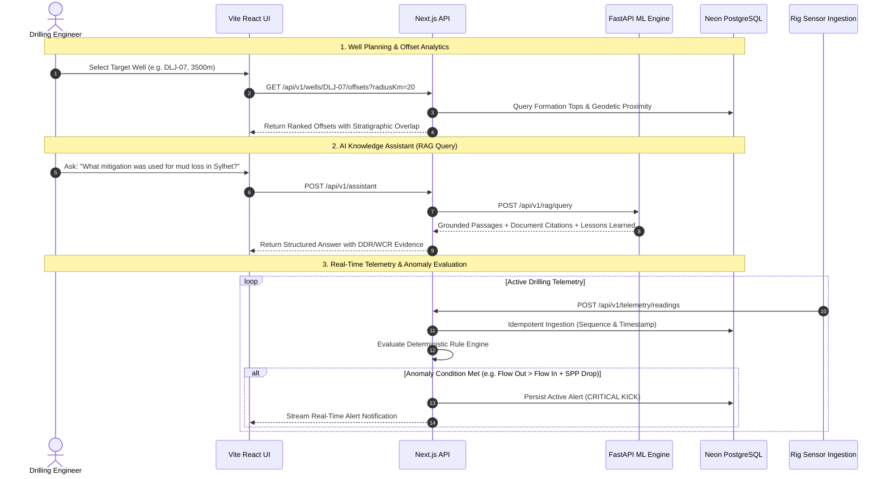

# 🌐 Nearby Wells Intelligence System (NWIS)

> **Smart India Hackathon 2026 — Problem Statement 121**  
> **Production-Grade Drilling Intelligence, Offset Well Similarity Analytics, Provenance RAG Assistant & Real-Time Telemetry Alerting Engine**

[](https://projectalteration-brown.vercel.app)
[](https://nextjs.org/)
[](https://react.dev/)
[](https://fastapi.tiangolo.com/)
[](https://neon.tech/)
[](https://www.prisma.io/)
[](https://python.org/)
[](https://www.typescriptlang.org/)

---

## 📑 Table of Contents

- [1. Executive Summary](#1-executive-summary)
- [2. System Architecture](#2-system-architecture)
- [3. End-to-End Operational Workflow](#3-end-to-end-operational-workflow)
- [4. Core Modules \& Features](#4-core-modules--features)
  - [A. Spatial Proximity \& Offset Analytics](#a-spatial-proximity--offset-analytics)
  - [B. Provenance-Tracked Technical Document Storage](#b-provenance-tracked-technical-document-storage)
  - [C. AI/ML Evidence-Backed RAG Assistant](#c-aiml-evidence-backed-rag-assistant)
  - [D. Machine Learning Risk Prediction](#d-machine-learning-risk-prediction)
  - [E. High-Throughput Telemetry \& Deterministic Alert Engine](#e-high-throughput-telemetry--deterministic-alert-engine)
- [5. Repository Structure](#5-repository-structure)
- [6. REST API Reference](#6-rest-api-reference)
- [7. Local Quickstart Guide](#7-local-quickstart-guide)
- [8. Vercel Multi-Service Deployment](#8-vercel-multi-service-deployment)
- [9. Data Provenance \& Security](#9-data-provenance--security)

---

## 1. Executive Summary

During well planning and active drilling operations, engineers must make rapid, high-consequence decisions. Unexpected subsurface hazards—such as **severe lost circulation (mud loss)**, **differential stuck pipe**, and **well kicks / influxes**—lead to catastrophic non-productive time (NPT) and significant financial loss.

**NWIS (Nearby Wells Intelligence System)** addresses this challenge through a multi-tier platform that integrates:
1. **Historical Offset Intelligence**: Automatic ranking and stratigraphy matching across offset wells in the Upper Assam basin.
2. **Deterministic Document Provenance**: Cryptographically verified extraction of events from Daily Drilling Reports (DDR), Well Completion Reports (WCR), and Mud Logs.
3. **Retrieval-Augmented Generation (RAG)**: Evidence-grounded AI knowledge assistant providing institutional lessons learned with direct page-level citations.
4. **Real-Time Telemetry & Alerting**: Out-of-order tolerant time-series ingestion and deterministic state-machine alert lifecycle management.

---

## 2. System Architecture

NWIS is engineered as a high-performance **Monorepo** following Clean/Hexagonal architecture:

```mermaid
flowchart TD
    subgraph Client ["Client Presentation Layer (Vite + React 19)"]
        UI[Interactive Map & Engineering Dashboard]
        RAG_UI[AI Knowledge Assistant Chat]
        TELEMETRY_UI[Live Telemetry Charts & Alert Feed]
    end

    subgraph Vercel ["Vercel Edge / API Gateway (Single Domain)"]
        GW[Vercel Rewrites / Router]
    end

    subgraph Backend ["Backend Service (Next.js 16 App Router)"]
        AUTH[Auth Guard & Jose JWT RBAC]
        WELL_SVC[Offset & Stratigraphy Engine]
        EVENT_SVC[Event Provenance & Review Workflow]
        TELEMETRY_SVC[Telemetry Ingestion & Rule Evaluator]
        RAG_GATEWAY[Assistant & ML Dispatcher]
        PRISMA[Prisma ORM 6.19]
    end

    subgraph ML_Service ["ML Intelligence Microservice (FastAPI + Python)"]
        RAG_ENGINE[RAG Knowledge Assistant (BM25 + Semantic)]
        RISK_MODEL[Mud Loss Random Forest Classifier]
        SIMILARITY[Spatial & Stratigraphic Similarity Engine]
        OCR_PIPE[Document Ingestion & OCR Extraction]
    end

    subgraph Storage ["Durable Infrastructure"]
        NEON[(Neon Serverless PostgreSQL)]
        DOCS[(Sanitized Technical Document Store)]
    end

    UI -->|/api/*| GW
    RAG_UI -->|/api/v1/assistant| GW
    TELEMETRY_UI -->|/api/v1/telemetry/*| GW

    GW -->|/api/v1/*| Backend
    GW -->|/(.*)| Client

    AUTH --> PRISMA
    WELL_SVC --> PRISMA
    EVENT_SVC --> PRISMA
    TELEMETRY_SVC --> PRISMA
    RAG_GATEWAY -->|Internal Service Binding| ML_ENGINE
    RAG_GATEWAY -.->|High-Availability Fallback| PRISMA

    PRISMA --> NEON
    EVENT_SVC --> DOCS
```

---

## 3. End-to-End Operational Workflow



---

## 4. Core Modules & Features

### A. Spatial Proximity & Offset Analytics
- **Multi-Factor Well Ranking**: Combines geodetic distance (Haversine formula), formation stratigraphic overlap, depth interval matching, and historical incident count.
- **Stratigraphic Correlation**: Automatic depth interval mapping across Upper Assam formations (**Tipam Sandstone**, **Surma**, **Barail**, **Kopili Shale**, and **Sylhet Limestone**).

### B. Provenance-Tracked Technical Document Storage
- **Cryptographic File Sanitization**: SHA-256 checksum generation, MIME-type validation, and path traversal protection.
- **Audit Logging**: Every document upload and event extraction maintains an immutable record tied to authenticated user IDs.

### C. AI/ML Evidence-Backed RAG Assistant
- **Dual-Mode Indexing**: Indexes chunked daily drilling reports and completion reports with page-level provenance.
- **High-Availability Fallback**: If the ML engine is cold-starting, the backend automatically falls back to database-indexed historical events to guarantee zero downtime.

### D. Machine Learning Risk Prediction
- **Mud Loss Classifier**: Trained Random Forest model predicting lost circulation probability and risk levels (`LOW`, `MEDIUM`, `HIGH`, `CRITICAL`).
- **Feature Importance**: Returns top contributing operational parameters (ROP, WOB, RPM, Torque, Mud Weight, ECD, SPP) and mitigation suggestions.

### E. High-Throughput Telemetry & Deterministic Alert Engine
- **Idempotent Ingestion**: Machine-authenticated telemetry ingestion with database-enforced unique constraints `(wellId, sourceId, sequenceNumber)`.
- **Alert State Machine**: Immutable lifecycle transitions:
  $$\text{ACTIVE} \longrightarrow \text{ACKNOWLEDGED} \longrightarrow \text{RESOLVED}$$

---

## 5. Repository Structure

```text
ProjectAlteration/
├── backend/                       # Next.js 16 Backend Service
│   ├── prisma/
│   │   ├── migrations/            # Version-controlled SQL migrations
│   │   ├── schema.prisma          # Database schema (Wells, Telemetry, Alerts, Events)
│   │   └── seed.ts                # Database seed script from ML dataset
│   ├── src/
│   │   ├── app/api/v1/            # 38 Clean REST API route endpoints
│   │   ├── application/           # Hexagonal application services & DTOs
│   │   ├── domain/                # Pure domain entities, rules & repository ports
│   │   ├── infrastructure/        # Prisma adapters, Jose JWT, ML Client, Storage
│   │   └── lib/                   # Standardized API response and error formatting
│   └── package.json
│
├── frontend/                      # Vite + React 19 Frontend UI
│   ├── src/
│   │   ├── api/                   # HTTP client with auto-session demo authentication
│   │   ├── components/            # Well maps, telemetry charts, RAG chat, alert panels
│   │   └── index.css              # Custom Tailwind CSS design tokens
│   ├── index.html                 # Google Fonts IBM Plex Sans & Leaflet setup
│   ├── vite.config.js             # Vite dev server with /api proxy
│   └── package.json
│
├── ml/                            # Python ML Microservice
│   ├── data/                      # Raw and processed historical drilling documents
│   ├── models/trained/            # Pre-trained mud loss joblib models
│   ├── pipelines/                 # PDF ingestion, OCR, and event extraction scripts
│   ├── src/                       # RAG assistant, retriever, and risk prediction code
│   ├── tests/                     # 36 Unit & integration tests (Pytest)
│   ├── serve.py                   # FastAPI REST server
│   └── requirements.txt
│
├── vercel.json                    # Vercel Multi-Service Project Configuration
└── README.md
```

---

## 6. REST API Reference

All protected endpoints accept session cookies or a Bearer token: `Authorization: Bearer <JWT_TOKEN>`.

### Authentication
| Method | Endpoint | Description |
| :--- | :--- | :--- |
| `POST` | `/api/v1/auth/demo` | Authenticates default demo engineer session |
| `POST` | `/api/v1/auth/login` | User login (email & password) |
| `POST` | `/api/v1/auth/register` | Register new user with RBAC role |
| `GET` | `/api/v1/auth/me` | Retrieve current authenticated user profile |

### Wells & Offset Intelligence
| Method | Endpoint | Description |
| :--- | :--- | :--- |
| `GET` | `/api/v1/wells` | List all indexed wells with optional field filters |
| `GET` | `/api/v1/wells/:id` | Get details and stratigraphic formation tops |
| `GET` | `/api/v1/wells/:id/offsets` | Discover and rank nearby offset wells with stratigraphy overlap |

### AI Knowledge Assistant & ML Risk
| Method | Endpoint | Description |
| :--- | :--- | :--- |
| `POST` | `/api/v1/assistant` | Natural language RAG query with page citations |
| `POST` | `/api/v1/telemetry/predict-risk` | ML inference for mud loss probability and risk level |

### Telemetry & Real-Time Alerts
| Method | Endpoint | Description |
| :--- | :--- | :--- |
| `POST` | `/api/v1/telemetry/readings` | Ingest rig sensor telemetry (machine authenticated) |
| `GET` | `/api/v1/wells/:id/telemetry` | Chronological time-series sensor data |
| `GET` | `/api/v1/wells/:id/alerts` | List active, acknowledged, and resolved alerts |
| `POST` | `/api/v1/alerts/:id/acknowledge` | Acknowledge active alert |
| `POST` | `/api/v1/alerts/:id/resolve` | Resolve acknowledged alert with engineer notes |

---

## 7. Local Quickstart Guide

### Prerequisites
- **Node.js**: `v20+` or `v22+`
- **Python**: `3.10+`
- **PostgreSQL**: Neon Cloud Database or local PostgreSQL instance

### 1. Clone & Configure Environment
```bash
git clone https://github.com/your-username/ProjectAlteration.git
cd ProjectAlteration
```

Create `backend/.env`:
```env
PORT=3000
NODE_ENV=development
DATABASE_URL="postgresql://<user>:<password>@<host>/<dbname>?sslmode=require"
JWT_SECRET="development_jwt_secret_min_32_characters_long_for_dev_test"
AI_ML_SERVICE_URL="http://localhost:8001"
```

### 2. Setup Python ML Microservice
```powershell
python -m venv .venv
.\.venv\Scripts\pip install -r ml/requirements.txt
```

Run tests to verify:
```powershell
$env:PYTHONPATH = "."
.\.venv\Scripts\pytest ml/tests
```

Start ML Server on port 8001:
```powershell
$env:ML_PORT = "8001"
.\.venv\Scripts\python ml/serve.py
```

### 3. Setup Backend & Seed Database
In a new terminal:
```powershell
cd backend
npm install
npx prisma db push
npx tsx prisma/seed.ts
npm run dev
```
Backend will start on [http://localhost:3000](http://localhost:3000).

### 4. Setup Frontend UI
In a new terminal:
```powershell
cd frontend
npm install
npm run dev
```
Open [http://localhost:5173](http://localhost:5173) in your browser.

---

## 8. Vercel Multi-Service Deployment

The repository is pre-configured with a root [`vercel.json`](file:///d:/ProjectAlteration/vercel.json) using **Vercel Services**:

```json
{
  "$schema": "https://openapi.vercel.sh/vercel.json",
  "services": {
    "backend": {
      "root": "backend",
      "framework": "nextjs",
      "bindings": [
        {
          "type": "service",
          "service": "ml",
          "format": "url",
          "env": "ML_SERVICE_URL"
        }
      ]
    },
    "frontend": {
      "root": "frontend",
      "framework": "vite"
    },
    "ml": {
      "root": "ml",
      "runtime": "python",
      "entrypoint": "serve.py"
    }
  },
  "rewrites": [
    {
      "source": "/api/(.*)",
      "destination": {
        "service": "backend"
      }
    },
    {
      "source": "/(.*)",
      "destination": {
        "service": "frontend"
      }
    }
  ]
}
```

### Deployment Steps on Vercel
1. Push this repository to GitHub.
2. Import the repository into **[Vercel](https://vercel.com/new)**.
3. Under **Project Settings → Environment Variables**, add:
   - `DATABASE_URL`: Your Neon PostgreSQL connection string.
   - `JWT_SECRET`: Secure 32+ character key.
4. Click **Deploy**. Vercel will build and serve all three services under a unified domain.

---

## 9. Data Provenance & Security

- **Zero Untracked Data**: Every event and alert trace directly back to a raw source document, page number, and timestamp.
- **Role-Based Access Control (RBAC)**:
  - `ADMIN`: Full platform configuration and audit access.
  - `DRILLING_ENGINEER`: Telemetry ingestion, event approval, and alert resolution.
  - `GEOLOGIST`: Stratigraphy analysis, formation editing, and document uploads.
  - `VIEWER`: Read-only access to offset intelligence, maps, and logs.
- **CSRF & Cookie Protection**: JWT access and refresh tokens stored in secure `HttpOnly`, `SameSite=Lax` cookies with CSRF header verification on mutable mutations.

---

## 👥 Contributors & Acknowledgements

Developed for **Smart India Hackathon 2026 (Problem Statement 121)**.  
Engineered for reliable, real-time subsurface operational intelligence.
