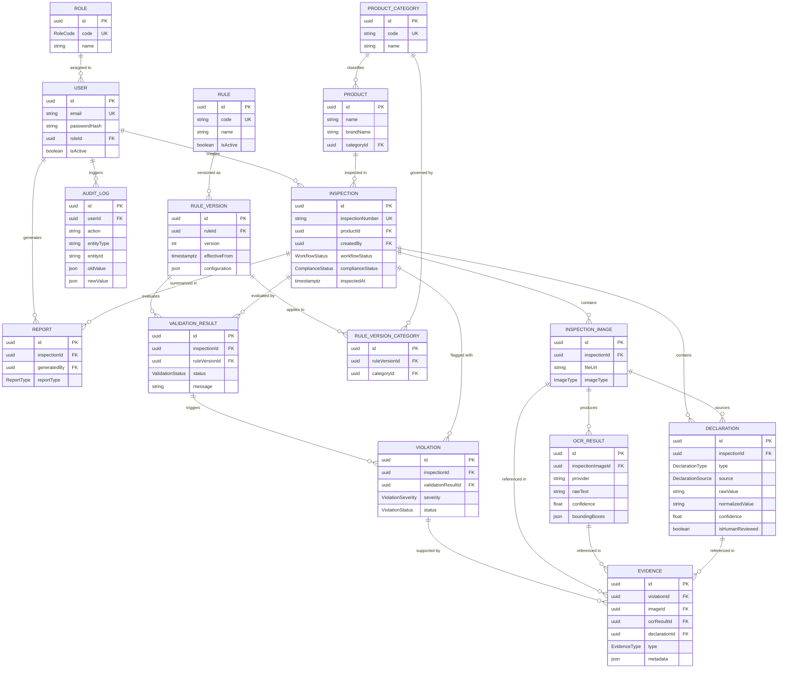

# SIH26034 Database Architecture & Entity Relationship Diagram

This document contains the complete database schema architecture, Entity Relationship (ER) diagram, entity definitions, and relationship cardinalities for **SIH26034** (Legal Metrology Packaged Commodities Rule Compliance Engine).

---

## 1. System ER Diagram (Mermaid)



---

## 2. Major Database Entities & Purpose

| Entity | Purpose / Description | Primary Key | Key Foreign Keys |
| :--- | :--- | :--- | :--- |
| **`Role`** | Role-Based Access Control (ADMIN, INSPECTOR, REVIEWER). | `id` (UUID) | None |
| **`User`** | System user accounts with hashed credentials and assigned roles. | `id` (UUID) | `roleId` -> Role |
| **`ProductCategory`** | Extensible product categories (Food, Beverage, Cosmetic, Household, etc.). | `id` (UUID) | None |
| **`Product`** | Physical product details being inspected across batches/locations. | `id` (UUID) | `categoryId` -> ProductCategory |
| **`Inspection`** | Central compliance evaluation record with `inspectedAt`, workflow & legal status. | `id` (UUID) | `productId` -> Product, `createdBy` -> User |
| **`InspectionImage`** | Metadata reference to packaging photographs (Front, Back, Side, etc.). | `id` (UUID) | `inspectionId` -> Inspection |
| **`OCRResult`** | Raw, immutable OCR text extraction output, confidence, and bounding boxes. | `id` (UUID) | `inspectionImageId` -> InspectionImage |
| **`Declaration`** | Extracted mandatory packaging attributes with `source` (OCR/AI/MANUAL) & nullable confidence. | `id` (UUID) | `inspectionId` -> Inspection, `sourceImageId` -> InspectionImage |
| **`Rule`** | High-level Legal Metrology rule definition (e.g. `LM-PC-MRP`). | `id` (UUID) | None |
| **`RuleVersion`** | Versioned legal rule requirement and validation criteria (preserves legal history). | `id` (UUID) | `ruleId` -> Rule |
| **`RuleVersionCategory`** | Join entity defining rule applicability per product category. | `id` (UUID) | `ruleVersionId` -> RuleVersion, `categoryId` -> ProductCategory |
| **`ValidationResult`** | Outcome of evaluating an inspection against a specific `RuleVersion`. | `id` (UUID) | `inspectionId` -> Inspection, `ruleVersionId` -> RuleVersion |
| **`Violation`** | Flagged compliance failure requiring resolution or human review. | `id` (UUID) | `inspectionId` -> Inspection, `validationResultId` -> ValidationResult |
| **`Evidence`** | Typed supporting evidence linking violations to images, OCR, or declarations. | `id` (UUID) | `violationId` -> Violation, `imageId`, `ocrResultId`, `declarationId` |
| **`Report`** | Generated PDF/summary compliance audit reports. | `id` (UUID) | `inspectionId` -> Inspection, `generatedBy` -> User |
| **`AuditLog`** | Comprehensive security and administrative action audit trail. | `id` (UUID) | `userId` -> User (nullable) |

---

## 3. Deletion Strategy & Integrity Protection

To protect legal compliance records from accidental or malicious data loss:
* **`onDelete: Restrict`**: Applied to `InspectionImage` -> `Inspection`, `OCRResult` -> `InspectionImage`, `Declaration` -> `Inspection`, `ValidationResult` -> `Inspection`, `Violation` -> `Inspection`, `Evidence` -> `Violation`, and `Report` -> `Inspection`. Prevents deleting completed compliance inspections and erasing historical evidence.
* **`onDelete: SetNull`**: Applied to `Evidence` -> `imageId` / `ocrResultId` / `declarationId`, `Declaration` -> `sourceImageId`, and `AuditLog` -> `userId` to maintain evidence log integrity.

---

## 4. Database Commands Reference

### Prisma Format & Validate
```bash
npx prisma format
npx prisma validate
```

### Prisma Client Generation
```bash
npm run prisma:generate
```

### Create & Apply Development Migration
```bash
npm run prisma:migrate
```

### Seed Initial Database Data
```bash
npm run prisma:seed
```

### Open Prisma Studio (GUI Database Viewer)
```bash
npm run prisma:studio
```
