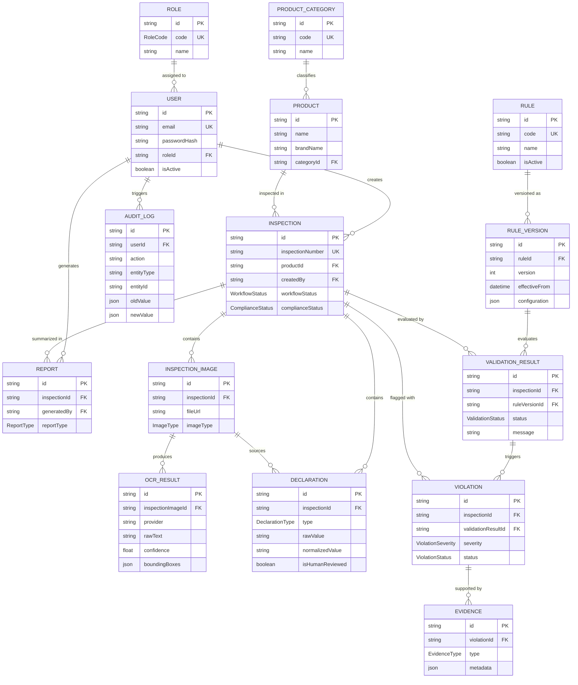

# SIH26034 Database Architecture & Entity Relationship Diagram

This document contains the complete database schema architecture, Entity Relationship (ER) diagram, entity definitions, and relationship cardinalities for **SIH26034** (Legal Metrology Packaged Commodities Rule Compliance Engine).

---

## 1. System ER Diagram (Mermaid)



---

## 2. Major Database Entities & Purpose

| Entity | Purpose / Description | Primary Key | Key Foreign Keys |
| :--- | :--- | :--- | :--- |
| **`Role`** | Role-Based Access Control (ADMIN, INSPECTOR, REVIEWER). | `id` (UUID) | None |
| **`User`** | System user accounts with hashed credentials and assigned roles. | `id` (UUID) | `roleId` -> Role |
| **`ProductCategory`** | Extensible product categories (Food, Beverage, Cosmetic, Household, etc.). | `id` (UUID) | None |
| **`Product`** | Physical product details being inspected across batches/locations. | `id` (UUID) | `categoryId` -> ProductCategory |
| **`Inspection`** | Central compliance evaluation record with workflow & legal status. | `id` (UUID) | `productId` -> Product, `createdBy` -> User |
| **`InspectionImage`** | Metadata reference to packaging photographs (Front, Back, Side, etc.). | `id` (UUID) | `inspectionId` -> Inspection |
| **`OCRResult`** | Raw, immutable OCR text extraction output, confidence, and bounding boxes. | `id` (UUID) | `inspectionImageId` -> InspectionImage |
| **`Declaration`** | Mandatory packaging attributes (MRP, Net Qty, Dates, Consumer Care, etc.). | `id` (UUID) | `inspectionId` -> Inspection, `sourceImageId` -> InspectionImage |
| **`Rule`** | High-level Legal Metrology rule definition (e.g. `LM-PC-MRP`). | `id` (UUID) | None |
| **`RuleVersion`** | Versioned legal rule requirement and validation criteria (preserves legal history). | `id` (UUID) | `ruleId` -> Rule |
| **`ValidationResult`** | Outcome of evaluating an inspection against a specific `RuleVersion`. | `id` (UUID) | `inspectionId` -> Inspection, `ruleVersionId` -> RuleVersion |
| **`Violation`** | Flagged compliance failure requiring resolution or human review. | `id` (UUID) | `inspectionId` -> Inspection, `validationResultId` -> ValidationResult |
| **`Evidence`** | Supporting evidence (bounding boxes, image regions, OCR text) for a violation. | `id` (UUID) | `violationId` -> Violation |
| **`Report`** | Generated PDF/summary compliance audit reports. | `id` (UUID) | `inspectionId` -> Inspection, `generatedBy` -> User |
| **`AuditLog`** | Comprehensive security and administrative action audit trail. | `id` (UUID) | `userId` -> User (nullable) |

---

## 3. Key Relationships & Cardinalities

* **User Management**: `1 Role` → `* Users`. `1 User` → `* Inspections`.
* **Products**: `1 ProductCategory` → `* Products`. `1 Product` → `* Inspections`.
* **Inspection Evidence**: `1 Inspection` → `* InspectionImages`. `1 InspectionImage` → `* OCRResults`.
* **Declarations**: `1 Inspection` → `* Declarations`.
* **Rule Engine**: `1 Rule` → `* RuleVersions`. `1 RuleVersion` → `* ValidationResults`.
* **Compliance Outcomes**: `1 Inspection` → `* ValidationResults`. `1 ValidationResult` → `* Violations`. `1 Violation` → `* Evidences`.
* **Auditability**: `1 User` → `* AuditLogs`. `1 Inspection` → `* Reports`.

---

## 4. Deletion Strategy & Integrity Protection

To protect legal compliance records from accidental or malicious data loss:
* **`RESTRICT`**: Applied to `User` -> `Role`, `Product` -> `ProductCategory`, `Inspection` -> `Product` / `User`, `ValidationResult` -> `RuleVersion`, and `Report` -> `User`. Prevents deleting referenced master data while historical compliance records exist.
* **`CASCADE`**: Applied to internal component trees (`Inspection` -> `InspectionImage`, `InspectionImage` -> `OCRResult`, `Inspection` -> `Declaration`, `Inspection` -> `ValidationResult`, `Violation` -> `Evidence`).
* **`SET NULL`**: Applied to `Declaration` -> `sourceImageId` and `AuditLog` -> `userId` to maintain log integrity even if a user account is removed.

---

## 5. Database Commands Reference

### Prisma Validate
```bash
npx prisma validate
```

### Prisma Client Generation
```bash
npm run prisma:generate
```

### Create & Apply Development Migration
```bash
npm run prisma:migrate
```

### Seed Initial Database Data
```bash
npm run prisma:seed
```

### Open Prisma Studio (GUI Database Viewer)
```bash
npm run prisma:studio
```
